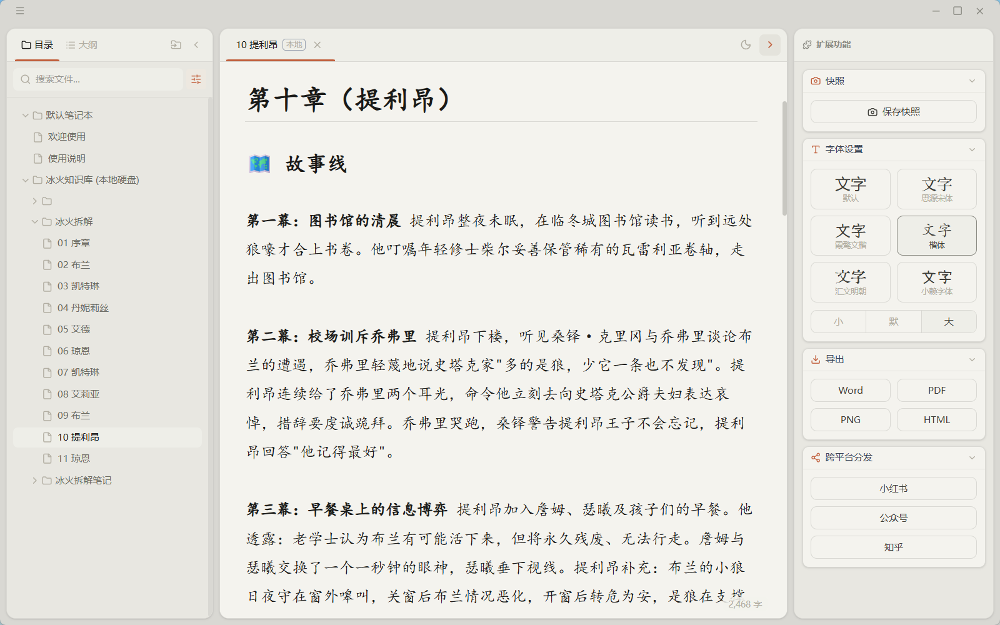
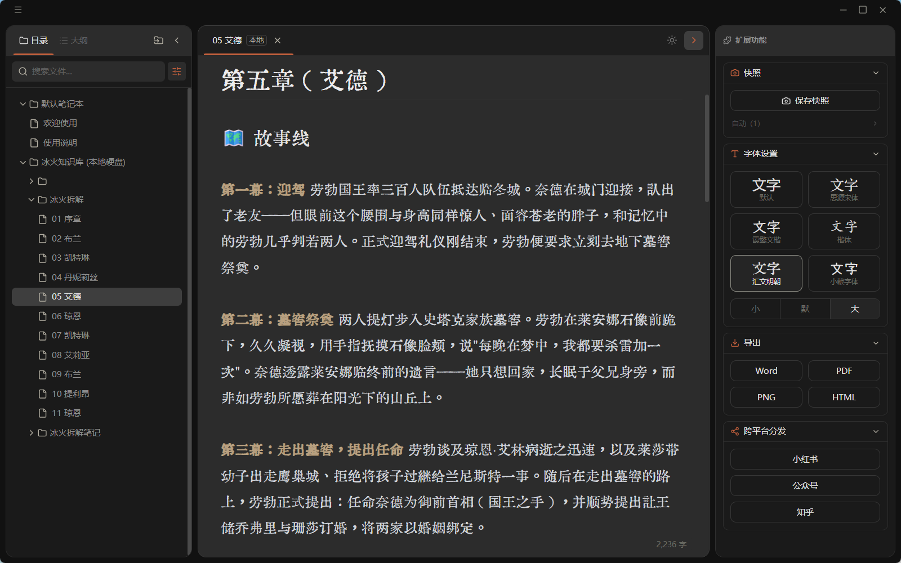

# 简码 Marka

> 纯粹、美观的 Markdown 写作环境，专为中文写作者打造。

**[→ 在线体验](https://my-marka.vercel.app/)**　　**[→ 下载 Windows 安装包](#下载)**

---

---

## 特点

- **所见即所得** — CodeMirror 6 引擎，标题、加粗、列表、代码块、表格实时渲染，语法符号智能隐藏
- **直连本地硬盘** — 挂载本地文件夹，直接读写 `.md` 文件，无需导入导出
- **多分屏对照** — 可拖拽调整宽度的分屏编辑，同时打开多个文件
- **快照版本历史** — 切换文件自动保存快照，支持手动命名，随时恢复历史版本
- **跨平台分发** — 一键复制为微信公众号、知乎富文本；小红书排版预览并导出图片组
- **导出多格式** — Word（.docx）、PDF、PNG、HTML
- **字体与主题** — 霞鹜文楷、汇文明朝、小赖等字体可选；深色 / 浅色主题切换
- **完全本地** — 无账号、无服务器、无上传

---

## 下载

前往 [Releases 页面](https://github.com/cytia/marka-releases/releases/latest) 下载最新版安装包。

| 平台 | 文件 | 系统要求 |
|------|------|----------|
| Windows | `Marka_x.x.x_x64-setup.exe` | Windows 10 1803+ |

下载后双击安装包即可，安装完成后桌面会出现 Marka 快捷方式。

---

## 数据与隐私

Marka 不包含任何服务端。所有文档、图片、快照均存储在你自己的设备上，不会上传到任何服务器。

---

## 已知问题

**光标移动卡顿**：用键盘控制光标朝加粗、斜体、行内代码、改色的文字移动时，光标到达文字边缘会出现不正常错位和卡顿，暂时未能找到解决方案。

**未实现的 Markdown 语法**：暂时不支持数学公式、注脚、HTML 等语法功能，待后续版本陆续添加。

---

© 2026 Cytia. 许可协议尚未确定，暂时保留所有权利。

